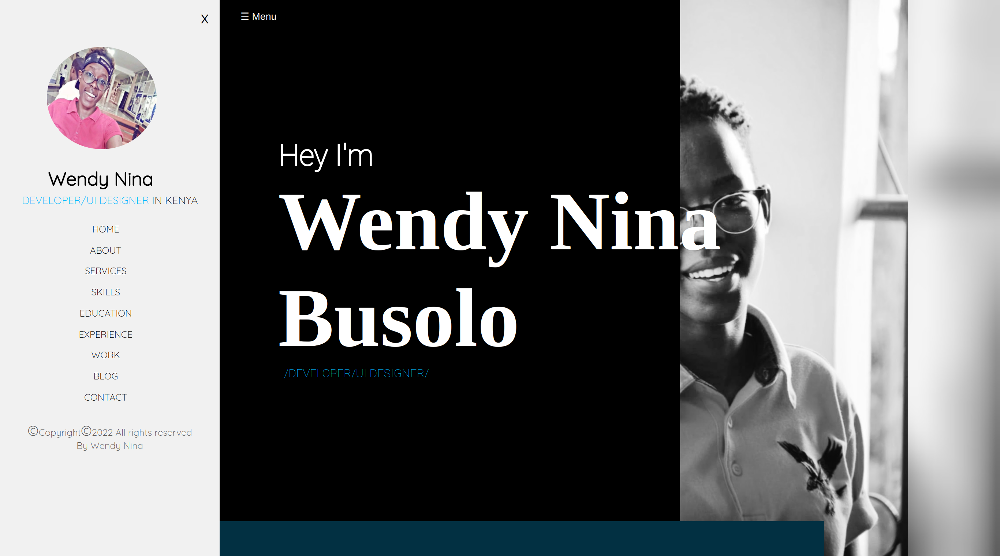

# Portfolio

#### By Wendy Nina

## Table of Content

+ [Description](#description)
+ [Installation Requirement](#Installation)
+ [Technology Used](#technology-used)
+ [Reference](#reference)
+ [License](#license)
+ [Authors Info](#author-Info)

## Description
This is a portfolio website that best describes who I am , my skills and professional background.
### Requirements
-Either a computer,phone,tablet or an Ipad
-Make sure you have access to internet
-Click on the live link in the about section

[Go Back to the top](#Portfolio)

### Installation Process
## Technology Used
HTML - which was used to build the structure of the pages.

 CSS - which was used to style the pages including the left aside navigation bar

 Vanilla JS -add functionality to the menu

## Reference
Materialize CSS

[Go Back to the top](#Portfolio)

# License
Copyright (c) 2022 [click to view License](LICENSE)

## Authors Info
Linked-[Wendy Nina]
(https://www.linkedin.com/in/wendy-nina-616559196/)

##### Link to live site
[Go Back to the top](#Portfolio)
